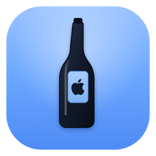

<div align="center">

# BottleLite



A lightweight, open-source macOS runner for Windows apps. Native SwiftUI, no Electron, no accounts, no telemetry, no bundled runtime — it drives the Wine you already have.

[](https://github.com/jx-grxf/BottleLite/actions/workflows/ci.yml)
[](https://github.com/jx-grxf/BottleLite/releases/latest)


[Download](https://github.com/jx-grxf/BottleLite/releases/latest) · [Release runbook](docs/release.md) · [Contributing](CONTRIBUTING.md) · [Security](SECURITY.md) · [Roadmap](#roadmap)

</div>

> [!NOTE]
> BottleLite 0.1.0 is a first preview release. It is ad-hoc signed but not yet
> Developer ID signed or notarized, so macOS will require the right-click → Open
> flow on first launch.

> [!TIP]
> Whisky — the popular SwiftUI Wine wrapper — is no longer maintained. BottleLite
> aims at the same "native, no-bloat" spot: a small app that manages bottles and
> runs your `.exe` files through an existing Wine, and nothing more.

## What it does

- **Bottles that persist.** Create, rename, and delete bottles. Records and
  imported programs are saved under Application Support and restored on launch.
  Deleting a bottle moves its Wine prefix to the Trash.
- **Import and validate.** Drop or pick an `.exe`; BottleLite checks the
  extension and `MZ` header and isolates each program in its bottle.
- **Run through Wine.** Launch and stop programs. The detected Wine version shows
  in the header, and every launch captures stdout/stderr to a per-program log you
  can open from the app.
- **Console tools work too.** BottleLite reads the Windows PE subsystem on import:
  GUI apps run quietly through Wine, while console/CUI tools open in Terminal.app
  so command output and prompts are visible. You can override this per program in
  Program Settings.
- **Installer → game flow.** Run an installer, then **Add Installed Program**
  scans the bottle's C: drive and adds the actual game/app it dropped — skipping
  uninstallers and redistributables — or browse C: manually.
- **Game Mode.** A per-bottle switch for extra performance: msync/esync,
  large-address-aware, higher process priority, a macOS power assertion (no App
  Nap / no idle sleep), and the Metal FPS overlay. Pair it with DXVK for the GPU
  side.
- **Per-bottle tooling.** Initialize the prefix (`wineboot`), open `winecfg`, run
  an installer, reveal the C: drive in Finder, and install common dependencies
  via winetricks (.NET, Visual C++, corefonts, DXVK, DirectX 9).
- **Lives in macOS.** SwiftUI sidebar/detail layout, menu commands and keyboard
  shortcuts, a Settings window, a multi-resolution app icon, and an ad-hoc
  signed preview build.
- **Sparkle updates.** Stable and beta update channels are wired through signed
  Sparkle appcasts published by GitHub Actions.

No telemetry, no account, no embedded browser, no bundled Wine.

## Install

1. Download the latest `BottleLite-<version>.dmg` from
   [GitHub Releases](https://github.com/jx-grxf/BottleLite/releases/latest).
   The release also includes a `.sha256` file so you can verify the download.
2. Open the DMG and drag `BottleLite.app` into Applications.
3. First launch on an unsigned preview build: right-click `BottleLite.app` → Open
   → confirm. Developer ID notarization is queued for a later release.

Requires macOS 14 or newer. For running programs you also need Wine:

```bash
brew install --cask wine-stable
# optional, for one-click dependencies:
brew install winetricks
```

BottleLite detects an existing Wine install; it can also open a Homebrew
installer in Terminal for you if none is found. It does not install or bundle
Wine inside the app.

## Usage notes

- Import GUI apps and installers with **Import .exe** or by dropping them into the
  selected bottle.
- Import command-line tools the same way. If the executable declares itself as a
  Windows console program, BottleLite opens it in Terminal.app instead of hiding
  its output in a background log.
- Add arguments from **Program Settings…**. Quote values with spaces, for example
  `-input "My File.pdf" -output out.pdf`.
- If a tool was misdetected, open **Program Settings…** and toggle **Run in
  Terminal** manually.

## Design principles

- **Mac-native first** — SwiftUI windows, toolbars, menus, Settings, system materials.
- **Runtime-agnostic** — detect existing Wine builds; never vendor a closed runtime.
- **Honest diagnostics** — show missing Wine, invalid `.exe` files, and launch logs clearly.
- **Hackable** — SwiftPM package, readable modules behind protocols, one build script.

## Build from source

```bash
git clone https://github.com/jx-grxf/BottleLite.git
cd BottleLite
make build
make test
make run        # stages and launches dist/BottleLite.app
```

Other targets:

```bash
make lint       # swift-format lint + shellcheck
make format     # apply swift-format in place
make icons      # regenerate the app icon set from assets/bottlelite_icon.svg
make package    # build dist/BottleLite-<version>.dmg
```

## Repository layout

```text
Sources/BottleLite/
  App/        App entry point and macOS activation
  Models/     Bottle, program, and runtime-status types
  Stores/     App state (BottleStore)
  Services/   EXE validation, Wine probing, running, tooling, persistence
  Views/      SwiftUI windows and panels
  Support/    Shell helper, on-disk layout, formatters
script/       build_and_run.sh · make_icons.sh · package_dmg.sh
assets/       Icon source (SVG) and generated .icns
Tests/        Swift Testing tests
```

## Release pipeline

Pushing a `vX.Y.Z` tag (matching `VERSION`) triggers the
[release workflow](.github/workflows/release.yml): it builds the app, packages a
release-mode DMG, signs a Sparkle ZIP/appcast, writes `SHA256SUMS`, optionally
notarizes when secrets are configured, and publishes a GitHub release. Full
runbook: [docs/release.md](docs/release.md). Public notes live in
[RELEASE_NOTES.md](RELEASE_NOTES.md).

Distribution roadmap:

- Developer ID signing and notarization once Apple Developer enrollment lands.
- Homebrew Cask after the first notarized release.

## Roadmap

- [x] Bottle persistence and management (rename, delete-to-Trash).
- [x] Run/stop programs through Wine with per-launch logs.
- [x] Per-bottle tooling: prefix init, winecfg, installers, winetricks, reveal C:.
- [x] Wine version detection in the UI.
- [ ] Per-bottle Windows version and Wine config presets.
- [ ] Bottle snapshots / duplication.
- [x] Sparkle stable/beta update channels.
- [ ] Developer ID signed and notarized releases.

### Non-goals

Reimplementing Wine · bundling Apple's Game Porting Toolkit · becoming a full
game launcher · tracking users or phoning home.

## Contributing

Issues and focused pull requests welcome. Read [CONTRIBUTING.md](CONTRIBUTING.md),
keep changes scoped, and run `make lint && make test` before opening a PR.
Security reports go through [SECURITY.md](SECURITY.md).

## License

MIT. See [LICENSE](LICENSE).
Johannes Grof — 2026
